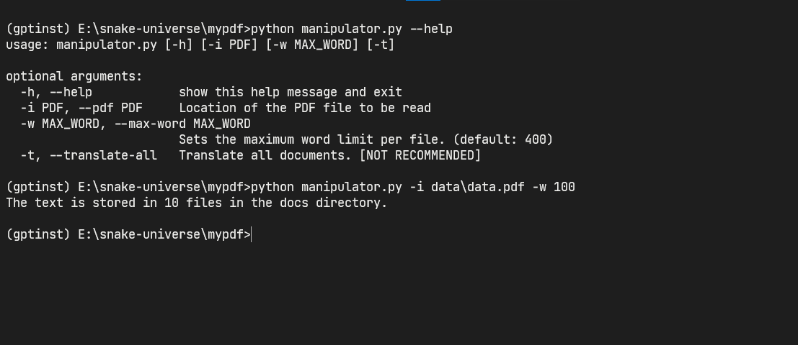
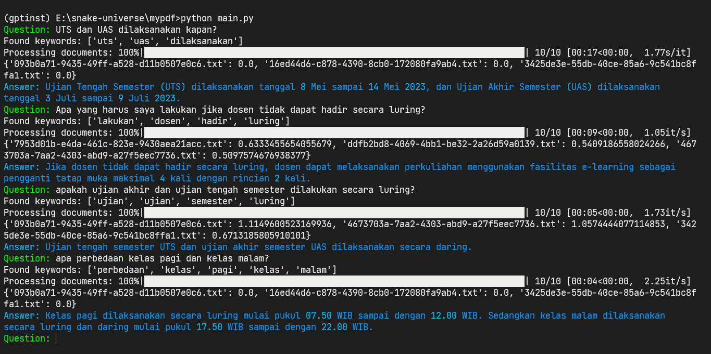
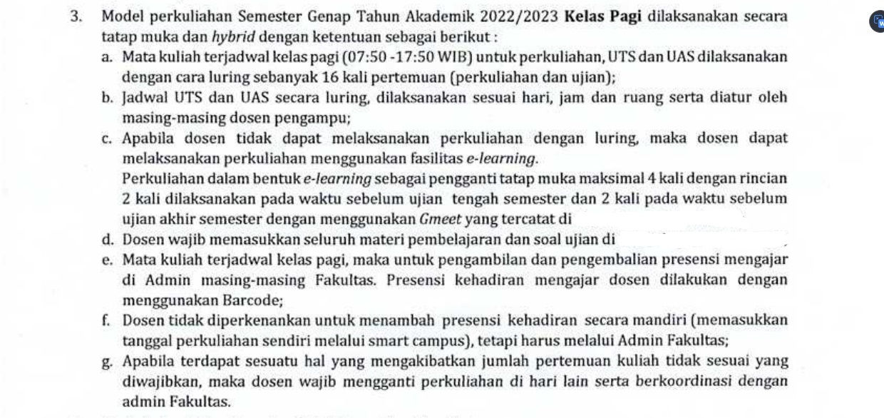
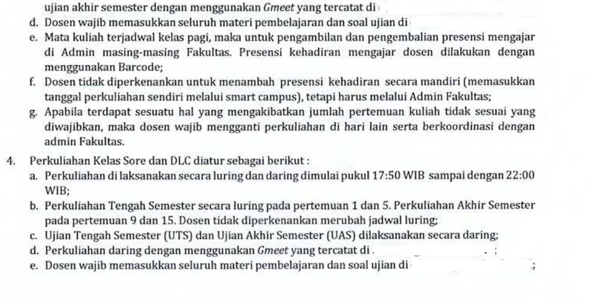

# Ask My PDF File

## Deskripsi

Program ini dibuat agar saya dapat dengan mudah **mencari informasi dalam dokumen-dokumen** dengan bantuan **pemrosesan bahasa alami** dan **machine learning**. Dengan antarmuka yang sederhana, saya bisa **mengajukan pertanyaan** dan mendapatkan **jawaban yang relevan** secara cepat dan efisien.

## Limitasi

* Hanya satu dokumen dalam satu percakapan.
* Menggunakan model **text-davinci-003**.
* Internet (wajib)
* Instruksi sederhana.

## Screenshots

